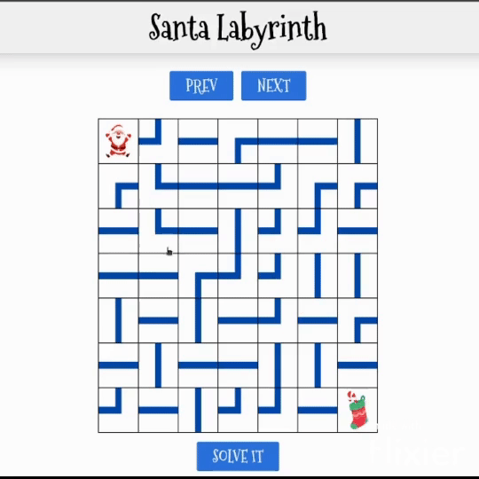

# Santa Labyrinth

**Número da Lista**: 44<br>
**Conteúdo da Disciplina**: Grafos2<br>

## Alunos

| Matrícula | Aluno                     |
| --------- | ------------------------- |
| 221007850 | Arthur Ribeiro e Sousa    |
| 211039484 | Iago Rocha Santos Marques |

## Sobre

Este projeto é uma adaptação do jogo [Santa Labyrinth](https://www.digipuzzle.net/christmas/cartoons/puzzles/labyrinth.htm?language=english&linkback=../../../education/christmas/index.htm), que consiste em um labirinto representado por um grid 7x7, onde o objetivo é levar o Papai Noel até a meia.

Nesse projeto, foi utilizado uma variação do algoritmo A* para encontrar um caminho válido para o Papai Noel. A implementação do backend foi feita em Rust, enquanto o frontend foi feito em React.

## Screenshots



## Instalação

Os pré-requisitos para a execução do projeto são:

- Docker 27.3.1
- Docker Compose 3.8
- GNU Make 4.3

## Uso

O jogo está disponível para uso a partir do link http://34.102.117.128:3000

Para executar o projeto localmente basta executar o seguinte comando:
```bash
make start
```

Após o comando ser executado, você pode acessar o projeto pelo link http://localhost:3000.

## Vídeo 

- [Apresentação](https://youtu.be/IBu_eWggxDI)
